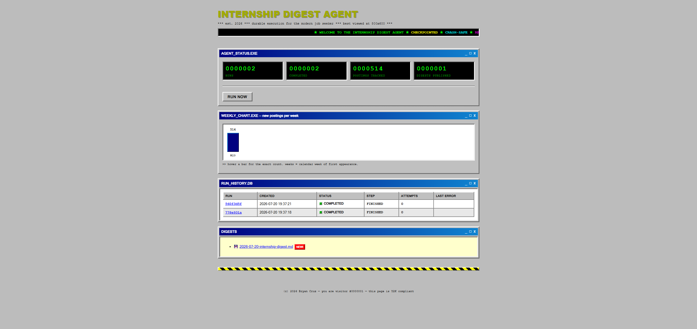

# Weekly Internship Digest Agent

[](https://github.com/Bryancruzcb/internship-digest-agent/actions/workflows/test.yml)

A scheduled agent that publishes a weekly digest of new software internship
postings. Under the hood it is a small durable-execution engine: every pipeline
step checkpoints its progress to SQLite, so if the process crashes mid-run, the
next cycle resumes from the failing step instead of starting over. The same
pattern — at a much larger scale — is what tools like Temporal, Airflow, and
AWS Step Functions provide.

## What a run does

1. **FETCH** — gathers postings from every configured source: the
   community-maintained
   [SimplifyJobs internship feed](https://github.com/SimplifyJobs/Summer2026-Internships)
   (the curated backbone), a per-company **ATS watchlist** polled directly
   (same-day freshness), and optionally your **Handshake job-alert emails**.
   Duplicate postings across sources are merged by company + title, with the
   direct ATS link winning.
2. **FILTER** — drops every posting that already appeared in a previous digest
   (tracked in a `seen_postings` table).
3. **SUMMARIZE** — asks an LLM (Gemini, OpenAI, or local Ollama) for a short
   overview of what's new. With no API key configured, the digest is published
   with a placeholder instead — a missing key is a configuration problem, not a
   transient failure, so it does not burn the retry budget.
4. **PUBLISH** — writes `reports/YYYY-MM-DD-internship-digest.md` and only then
   marks the postings as seen. A run that failed before publishing keeps its
   postings eligible for the next digest.

The first run publishes a large catch-up digest (everything currently active);
every run after that reports only what's new. See a real (trimmed) example in
[docs/sample-digest.md](docs/sample-digest.md).

## Reliability design

* **Checkpoint persistence** — each run's status, step pointer, and
  accumulated data live in SQLite (`agent_state.db`). After a step succeeds,
  the checkpoint points at the *next* step, so a crash at any moment never
  re-runs a finished step.
* **Retries for transient failures** — a failing step gets 3 attempts (one per
  scheduler cycle). After the third failure the run is halted for good and the
  next cycle starts a fresh run; halted runs are never resurrected.
* **Crash vs. active detection** — a run whose heartbeat is fresh is being
  executed by a live process, and other cycles skip it. A run stuck in
  `running` past the stale cutoff (default 30 min) is treated as crashed and
  resumed. Ownership is taken with an atomic claim, so two processes cannot
  execute the same run.
* **Idempotent publishing** — the report write and seen-marking are both safe
  to repeat, which is what makes resume-after-crash correct.

## Setup

```bash
pip install -r requirements.txt
cp env.example .env   # then add an API key if you want LLM summaries
```

## Running

```bash
python run_agent.py    # one-off run (also resumes an interrupted run)
python scheduler.py    # daemon: runs weekly (Monday 09:00 by default)
```

For a fast local demo, set `AGENT_INTERVAL_SECONDS=30` in `.env` and the
daemon runs on that interval instead of weekly.

## Dashboard

```bash
python dashboard.py    # http://127.0.0.1:5000
```

A local web view over the agent's SQLite state: hit-counter stats, new-
postings-per-week bars, every run with its status and retry count, the per-run
step audit trail, and the published digests rendered in the browser. The Run
Now button triggers a run in the background — and if one is already active,
the agent's own concurrency guard refuses the second one, which you can watch
happen.

The dashboard deliberately wears a Windows 95 aesthetic — beveled buttons,
title bars, green phosphor counters. The agent is a small system utility, so
it dresses like one. (Zero external assets: one inline stylesheet, no
webfonts, no JavaScript frameworks.)



## Testing

```bash
pip install -r requirements-dev.txt
python -m pytest
```

The tests cover the state machine (halt-for-good after max retries, fresh run
after a halt, resume-at-failing-step, checkpoint-points-at-next-step, active
vs. stale run handling), the dedupe/publish behavior, and the feed
normalization. No test touches the network.

## Configuration (`.env`)

| Variable | Default | Purpose |
|---|---|---|
| `GEMINI_API_KEY` / `OPENAI_API_KEY` | – | Enables LLM summaries |
| `AGENT_PROVIDER` | `gemini` | `gemini`, `openai`, or `ollama` |
| `AGENT_MODEL` | `gemini-flash-lite-latest` | Model id; the `-latest` alias auto-tracks Google's current model |
| `OLLAMA_BASE_URL` | `http://localhost:11434/v1` | Local Ollama endpoint |
| `LISTINGS_URL` | SimplifyJobs Summer 2026 feed | Feed JSON to pull |
| `FILTER_TERMS` | `Summer 2026,Fall 2026,Summer 2027` | Comma-separated term tags to keep |
| `WATCHLIST_PATH` | `watchlist.json` | Company ATS watchlist file |
| `HANDSHAKE_IMAP_USER` / `HANDSHAKE_IMAP_PASSWORD` | – | Enables Handshake alert-email parsing |
| `SCHEDULE_DAY_OF_WEEK` / `SCHEDULE_HOUR` | `mon` / `9` | Weekly schedule |
| `AGENT_INTERVAL_SECONDS` | – | Demo mode: run every N seconds |
| `STALE_RUN_MINUTES` | `30` | Heartbeat age before a run counts as crashed |

The SimplifyJobs repo carries every season in one feed (Summer 2026, Fall
2026, Summer 2027 and beyond as term tags), so rolling to a new cycle is just
an edit to `FILTER_TERMS` — no repo switch needed.

## Company watchlist

`watchlist.json` lists companies whose ATS the agent polls directly — public
JSON endpoints, no API keys. Supported: `greenhouse` (board token), `lever`
(company token), `ashby` (org name), and `oracle_orc` (Oracle Recruiting
Cloud host + site number — what UL Solutions uses, included as the default
entry). Titles are filtered for intern/co-op roles; an optional
`location_contains` filter keeps only matching locations. One company's
endpoint failing is logged and skipped, never fatal.

To add a company, find its apply-link domain in any digest: a
`boards.greenhouse.io/<token>` link means `{"source": "greenhouse",
"token": "<token>", "company": "..."}` — same idea for `jobs.lever.co` and
`jobs.ashbyhq.com` URLs.

## Connecting Handshake

Handshake has no public API, and its terms of service prohibit scraping
logged-in sessions — so this agent uses the one channel Handshake officially
sends data through: **saved-search job alert emails** (each contains up to 25
matching postings). Setup, one time:

1. In Handshake, save a job search (e.g. software internships near you) and
   enable email alerts for it.
2. Create a [Gmail app password](https://myaccount.google.com/apppasswords)
   and set `HANDSHAKE_IMAP_USER` / `HANDSHAKE_IMAP_PASSWORD` in `.env`.

The agent then reads the last week's alert emails over IMAP (read-only) each
run and folds those postings into the digest. Alternatively, some career
centers publish a public Handshake "External Feed" RSS link — if yours does,
that is worth asking for.

## Limitations

* Single machine, single SQLite file — this is deliberate; the project is
  about durable-execution mechanics, not distributed infrastructure.
* Retries happen once per scheduler cycle, so with the weekly schedule a
  transient failure waits a week to retry. Run `python run_agent.py` to retry
  immediately.
* The digest only knows what the SimplifyJobs feed knows.
